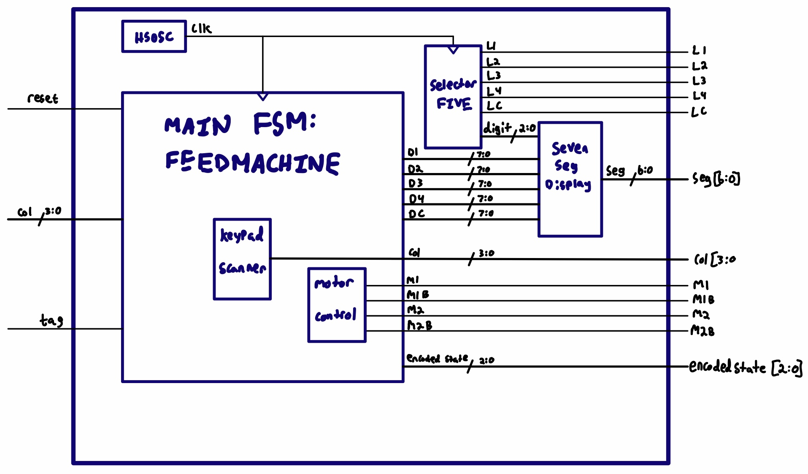

## Schematics
<!-- Include images of the schematics for your system. They should follow best practices for schematic drawings with all parts and pins clearly labeled. You may draw your schematics either with a software tool or neatly by hand. -->

  

Figure 1. MCU Schematic.

  

Figure 2. FPGA Schematic.

  

Figure 3. FPGA Block Diagram.

  

Figure 4. FPGA Main FSM.

  

Figure 5. Keypad Scanner FSM.

## Source Code Overview
<!-- This section should include information to describe the organization of the code base and highlight how the code connects. -->

<i>The source code for the project is located in the Github repository [here](https://github.com/cturek/E155-Autofeeder/tree/main/src).</i>

# MCU

The MCU will control the character LCD[3](https://cturek.github.io/E155-Autofeeder/resources.html), as well as receive information from the RFID reader[4](https://cturek.github.io/E155-Autofeeder/resources.html).

The RFID reader will sit in an idle state and wait for a card to be detected in front of it. When a card is detected, the reader sends a signal high to the MCU. This signal will trigger an interrupt which initiates a USART transaction. The RFID reader will be configured to ASCII mode, where it will send the ID of the card in ASCII format over USART into the MCU. The MCU will then decode the ASCII from the serial transaction, and if the correct card is detected, it will send a signal to the FPGA.

The character LCD will display the many different states that the autofeeder can be in, such as asking the user to input feed times, displaying the world time, or even the current feed amount. This state will be determined by the 3 bit signal the FPGA sends, where the MCU will begin to decode the signal after the FPGA first triggers an interrupt on it on another wire.

The function behind the character LCD and how to write characters to it is quite simple. It has 8 different pins which correspond to 8 bits representing an ASCII character. To write, the "Register Select" pin needs to be set high, while the "Read/Write" pin needs to be set low. Lastly to input the desired character onto the LCD, the "Enable pin needs to be toggled high and then low, with whatever delay the datasheet asks for.

For example, if one wanted to write an "A" onto the LCD, they would write a "01000001" on pins DB7-DB0, set RS to 0, set R/W to 1, and then toggle E high and low. After a character is written, the LCD automatically sets the cursor to the next open space. If the user wants to write on the second line, they would need to set the cursor address to whatever address the first space of the second line has. The instructions to do special functions like these are described in the datasheet for the LCD.

# FPGA

Shown in the figures above, the FPGA interfaces with the four digit seven segment display, the four by four keypad, and the motor. Each of these interfaces is carried out using an FSM; the more interesting ones (keypad and display) are shown above, while the motor FSM is trivial and is not shown. The FPGA encodes its display state as a 3 bit signal and sends it over to the MCU.

Since we are not interested in typing letters, we configure three of the six non-numerical buttons to alternate functions. This means that when those specific buttons are pressed, the state machine will perform some logic internally rather than displaying a digit. For example, if the MODE button is pushed, the auto feeder will shift from one state to another, which will likely require the displayed digits to change.

Second, the four digit 7-segment display actually has five common anodes: one for each of the digits, and one more for the central colon and degree symbol. Thus, we have to keep track of four different digit values now and must also come up with a way to display the colon properly. Implementing this is not so hard; all we need to do is add two more shifts to go to the third and fourth digits. The colon only has two states: displayed (for clock) or hidden (for feed amount), so it will not be hard to send bits high or low depending on the internal FSM. 

The final piece of hardware that the FPGA controls is the stepper motor. We are using a NEMA 17 bipolar stepper rated at 12V[5](https://cturek.github.io/E155-Autofeeder/resources.html). It offers 200 steps per revolution, and can operate at 60 RPM. However, the motor operates on 12V at 350mA while the FPGA sets pins to 3.3V with near zero current. To give enough voltage and current to this motor, we are using the STM L293D[6](https://cturek.github.io/E155-Autofeeder/resources.html) push/pull channel driver as a dual H-bridge. 

## Bill of Materials
<!-- The bill of materials should include all the parts used in your project along with the prices and links.  -->

| Item | Part Number | Quantity | Unit Price | Link |
| ---- | ----------- | ----- | ---- | ---- |
| Adafruit NEMA-17 Stepper Motor | 324 | 1 | $14.00 |  [Motor](https://www.adafruit.com/product/324) |
| ID-12 RFID Reader | EN-11827 | 1 | $32.50 | [RFID](https://www.sparkfun.com/products/11827) |
| 125kHz RFID Card | COM-14325 | 2 | $2.10 | [Tag](https://www.sparkfun.com/products/14325) |
| Quad 7-Segment Common Anode Display | LTC-4627JS | 1 | $3.57 | [LED](https://www.digikey.com/en/products/detail/lite-on-inc./LTC-4627JS/408219) |
| 2x16 LCD Display | MC21605A6W-FPTLW | 1 | $5.00 | [LCD](https://www.digikey.com/en/products/detail/midas-displays/MC21605A6W-FPTLW/13970956?utm_adgroup=Optoelectronics&utm_source=google&utm_medium=cpc&utm_campaign=Shopping_DK%2BSuppliers_Midas%20Displays&utm_term=&utm_content=Optoelectronics&gclid=EAIaIQobChMIloym-9yE-wIVniytBh2NSQDmEAQYASABEgK5TfD_BwE) |

**Total cost: $57.90**
