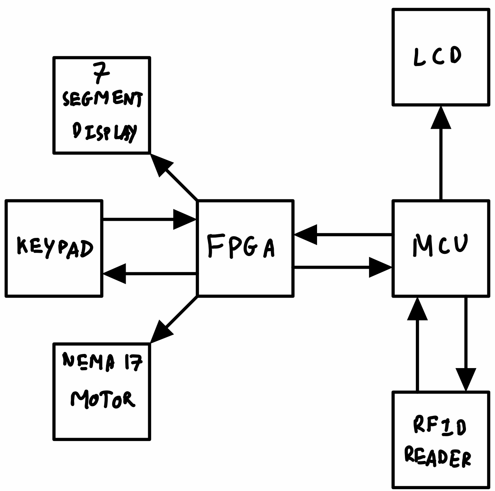
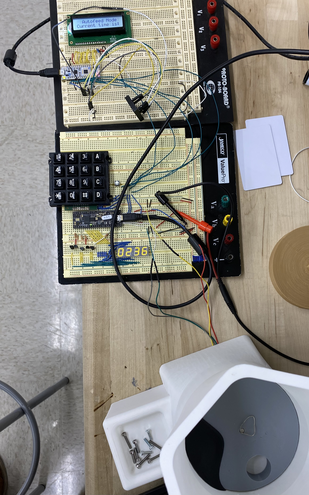

# Project Abstract

  

<i>Automatic pet feeders have become an increasingly popular choice for pet owners around the globe. They offer an easy way to keep their pets fed while away, be it at work or on vacation. Autofeeders are also useful for measuring out exact portions, and pets become trained to eat at regular times and not to bother their owner when they're ready for another meal. In this project, we create an autofeeder capable of feeding animals at regularly scheduled times.</i>

# Project Motivation

Commercial autofeeders are expensive and non-modular. Here, we create the beginnings of an autofeeder which can be altered such that it is capable of feeding multiple pets, each with different amounts of food served at different times. 

# Project Description

The auto feeder will be able to take in multiple configuration inputs, such as dispensing amount, current world time, and desired feed time. A successful auto feeder should be able to correctly dispense an amount of food by spinning a tube at the bottom of the food reservoir. This tube will hold a premeasured amount of food, allowing it to flow into a feeding tray. While idle, it should display the current time on a quad 7-segment time display, and when prompted it should show different configuration options on a character LCD. The design will incorporate a Field-Programmable Gate Array (FPGA)[1](https://cturek.github.io/E155-Autofeeder/resources/) and a Microcontroller Unit (MCU)[2](https://cturek.github.io/E155-Autofeeder/resources/).

The system will also be configurable into two different modes, “Timed mode” and “RFID mode”. In timed mode, the system will only dispense food when the world time is equal to the feed time. In “RFID mode” the system will only dispense when a Radio-frequency identification (RFID) tag is present, and will only allow another dispense after a set delay.

The FPGA will keep track of the mode which the quad 7-segment display is operating in and control the digits themselves. The FPGA will also control the number of rotations of the stepper motor. The MCU will take the mode from the FPGA and return the appropriate message. This will describe the current LED display and/or prompt the user for keypad input. The MCU and FPGA will be connected over SPI. In the next sections we will describe the functions and routines that have been written for both the FPGA and the MCU.

# System Block Diagram

The high level block diagram is shown below:

  

The FPGA interfaces with an LED display, a keypad, and a motor. The MCU interfaces with a liquid crystal display (LCD) and a radio-frequency identification (RFID) reader. The FPGA and MCU are connected to tie the two systems together. 

In the figure below, the top breadboard connects the MCU (white) with the LCD and the RFID reader (floating, black). The bottom breadboard connects the FPGA (blue), the keypad, the LED display, and the motor (under the autofeeder housing).

  

