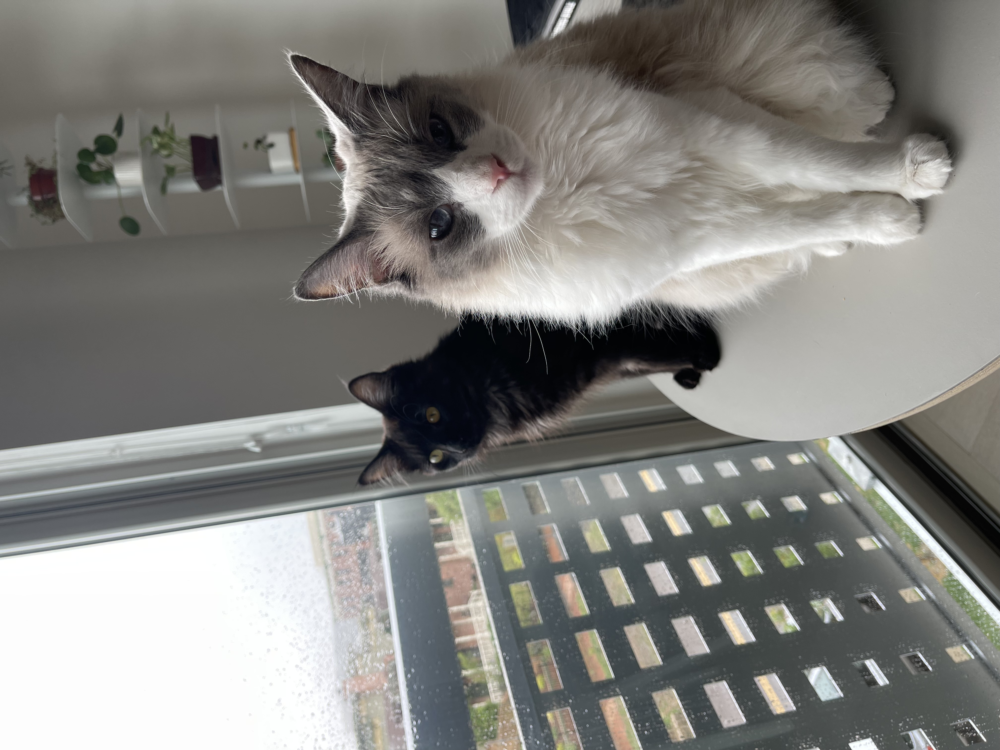

## References

1. > Tindie, “UPduino v3.1 low cost Lattice iCE40 FPGA board", San Francisco, CA, USA, August 2020. Accessed Nov 17 2022. [Online]. Available at: https://www.tindie.com/products/tinyvision\_ai/upduino-v31-low-cost-lattice-ice40-fpga-board/ 

2. > STMicroelectronics, “STM32 Nucleo-32 development board with STM32L432KC MCU", Geneva, Switzerland, March 2021. Accessed Nov 17 2022. [Online]. Available at: https://www.st.com/en/evaluation-tools/nucleo-l432kc.html 

3. > Midas Displays, “MC21605A6W-FPTLW Datasheet”, Norfolk, England, February 2011. Accessed Nov 17 2022. [Online]. Available at: https://media.digikey.com/pdf/Data%20Sheets/Midas%20Displays/MC21605A6W-FPTLW.pdf

4. > ID-Innovations, “ID-3/12/20 LA Series Datasheet X2.01”, Canning Vale, Western Australia, May 2020. Accessed Nov 17 2022. [Online]. Available at: https://cdn.sparkfun.com/assets/9/3/0/5/2/DS-11827-RFID_Reader_ID-12LA__125_kHz_.pdf

5. > Adafruit, “Stepper motor - NEMA-17 size - 200 steps/rev, 12V 350mA”, New York City, New York, 2019. Accessed Nov 17 2022. [Online]. Available at: https://www.adafruit.com/product/324 

6. > STMicroelectronics, “PUSH-PULL FOUR CHANNEL DRIVER WITH DIODES”, Geneva, Switzerland, July 2003. Accessed Nov 17 2022. [Online]. Available at: https://www.arduino.cc/documents/datasheets/H-bridge_motor_driver.PDF

## Inspiration

The inspiration for this project came from Manuel's two cats. Before the second cat was adopted, the first cat had an autofeeder all to himself. When the second cat was adopted, it brought challenges that were not expected; for one, it was not ideal to have an single small tray for both cats to feed from. And simply buying a second autofeeder was not a desirable option, as they can be quite costly. So we set out to make an autofeeder with customizable lower sections that could accomodate different feeding trays for varying numbers of cats. Due to time constraints, the mechanical aspect of the E155 project was limited to simply having one feeding tray, but the hope is that the we can continue on this project in the future and complete the goal of having customizable amounts!

  

<<<<<<< HEAD

Pepper (Left) and Mashed Potato (Right), the Inspiration for this Project

=======

Pepper (left) and Mashed Potato (right), the Inspiration for this Project

>>>>>>> 03eb8b10b1a95de8b5c99f847878712ae90918d0
